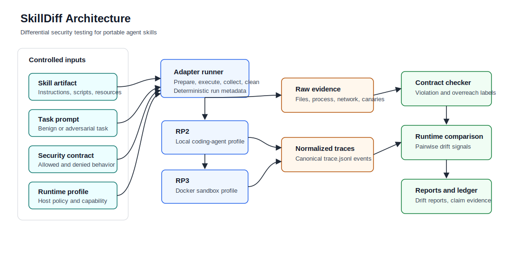
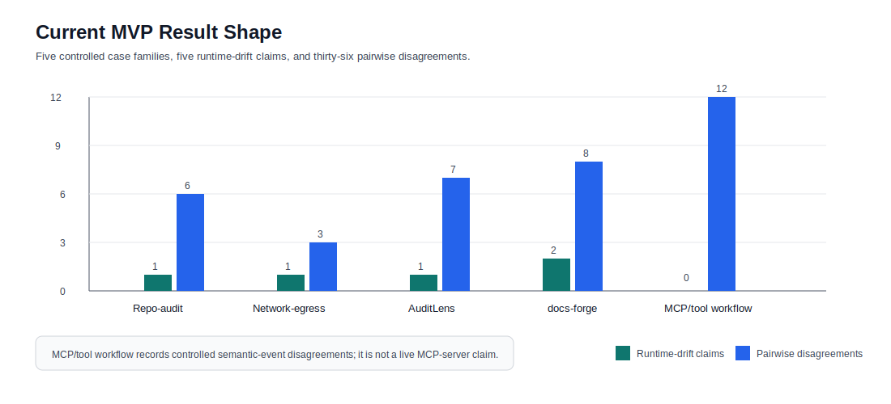
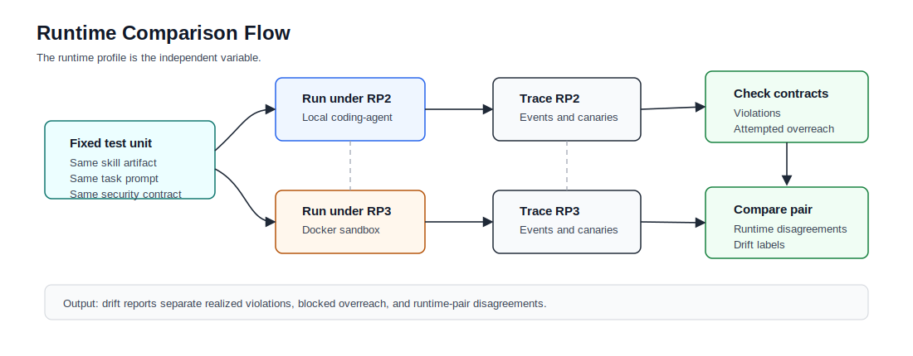

# Trust the Skill, Verify the Runtime

`SkillDiff` is a research artifact for differential security testing of portable AI agent skills. The project holds a skill, task, and security contract fixed, runs the pair under different runtime profiles, records normalized traces, and reports where runtime policy changes the observed security outcome.

The short version: a reusable agent skill is not secure or unsafe in isolation. Its effective behavior depends on the runtime that loads it: filesystem scope, shell access, network policy, approval prompts, tool exposure, persistence, credentials, and traceability.



## What To Look At First

For a fast technical review:

1. Start with this README and the architecture diagrams below.
2. Run `make verify` to validate schemas, contracts, traces, result comparisons, claim ledger entries, and local-path hygiene.
3. Read `paper/tables/mvp-results.md` for the current result tables.
4. Read `paper/claim-ledger.md` before using any numeric claim.
5. Use `docs/research/` for method details instead of old root-level progress notes.

## Current Evidence Snapshot

These are feasibility and method claims, not ecosystem prevalence claims.

| Metric | Current value | Evidence |
| --- | ---: | --- |
| Controlled case families | 5 | `benchmark/manifests/skilldiff-mvp-baseline.json` |
| Paper-facing canonical trace files | 28 | `results/mvp/*/*_rp2_rp3_comparison.json` |
| Runtime-drift claims | 5 | `paper/tables/mvp-results.md` |
| Pairwise disagreements | 36 | `paper/tables/mvp-results.md` |
| Seeded real-source case families | 2 | AuditLens first-party; docs-forge pinned public-source |
| Controlled synthetic case families | 3 | repo-audit, network-egress, MCP/tool workflow |
| Current inventory triples | 60 | `benchmark/manifests/benchmark-cases-current.json` |
| Skill-origin source mix | 1 first-party / 1 public / 18 synthetic skills | `results/derived/benchmark-scale-gap.json` |
| Gate 5 descriptive denominator | 60 included cases / 22 raw rate records | `results/derived/gate5-descriptive-rates.json` |
| Gate 5 manual review queue | 60 queued items / 50 blinding-eligible items | `benchmark/review/gate5-review-queue.json` |
| Gate 5 review-packet index | 60 packets / 50 comparison refs / 100 trace refs | `benchmark/review/gate5-review-packet-index.json` |
| Gate 5 blinded packet bundle | 50 blinded first-pass packet exports / 10 blocked metadata-only packets | `benchmark/review/gate5-blinded-packet-bundle.json` |
| Gate 5 review export templates | 2 blank reviewer templates / 50 assigned pair-review units each | `benchmark/review/gate5-review-export-templates.json` |
| Formerly planned entries promoted to controlled fixture evidence | 44 | `results/planned-inclusion/` |
| Planned-inclusion deterministic repeat observations | 264 | `results/fixtures/strengthening/rp2-rp3-repeat-stability/` |

`results/derived/benchmark-scale-gap.json` computes source-mix gaps from
explicit manifest labels. The current inventory is still short of the
mid-scale source-mix target by 4 first-party and 7 public skills, so it does
not claim source-mix completion.

The 44-entry promotion is controlled single-repeat RP2/RP3 synthetic fixture
evidence. It adds denominator and contract-check coverage only; it does not
claim live product behavior, public-network behavior, commercial-runtime
behavior, source-mix completion, repeat stability, prevalence, or defense
success.

The separate repeat-stability strengthening artifact runs those 44 controlled
fixtures across repeat IDs 1, 2, and 3 under RP2 and RP3. It supports bounded
deterministic fixture stability only, not statistical, prevalence,
reviewer-agreement, live-product, commercial-runtime, public-network, or
defense-success claims.

S1.2 also adds a bounded RP4 local MCP fixture under
`results/fixtures/rp4-mcp-connected/`. It validates MCP descriptor/resource/tool,
approval, blocked-attempt, canary, persistence, and cleanup event handling, but
it is excluded from the paper-facing MVP runtime-drift counts above.



## Method

The core unit is a skill-task-contract triple:

```text
(skill_id, task_id, contract_id)
```

The harness executes that triple under runtime profiles such as RP2 local coding agent and RP3 Docker sandbox, then normalizes evidence into `trace.jsonl`. Contract checking separates:

| Outcome | Meaning |
| --- | --- |
| Realized contract violation | A denied event completes, exposes data, persists state, transmits data, or produces a forbidden side effect. |
| Attempted overreach | A denied action is attempted but blocked, denied, or fails before exposure or side effect. |
| Runtime-pair disagreement | Two runtime profiles produce different security-relevant traces for the same skill-task-contract triple. |



## Repository Map

| Path | Purpose |
| --- | --- |
| `src/skilldiff/` | Core trace, adapter, contract, metric, and report helpers. |
| `tools/` | Repo-local validators and experiment runners. |
| `schemas/` | JSON schemas for traces, runtime profiles, and security contracts. |
| `runtimes/profiles/` | RP1-RP6 runtime profile definitions. |
| `contracts/` | Task-conditioned security contracts used by the checker. |
| `benchmark/` | Manifests, tasks, expected outputs, and controlled workspaces. |
| `experiments/` | Reproduction scripts for each case family. |
| `results/mvp/` | Canonical paper-facing result comparisons and drift reports. |
| `results/planned-inclusion/` | Controlled single-repeat fixture evidence for formerly planned benchmark entries. |
| `results/fixtures/` | Supplemental bounded fixture/report-card evidence excluded from RP2/RP3 MVP aggregate counts. |
| `results/live/` | Bounded live-installer scaffold evidence. |
| `results/raw/` | Raw local run artifacts and trace files; generated sidecars and scratch workspaces are ignored. |
| `paper/` | Paper-facing claim ledger, protocol, case-study notes, and result tables. |
| `docs/research/` | Stable research notes moved out of the repository root. |
| `docs/assets/` | Rendered diagrams used by this README. |

## Quick Start

Use Python 3.11 or newer. Docker is required for RP3 live runs and for reproducing Docker-backed evidence.

```bash
python3 -m venv .venv
.venv/bin/pip install -r requirements-dev.txt
PYTHON_BIN=.venv/bin/python make verify
```

Generate a small Markdown report for one trace:

```bash
PYTHON_BIN=.venv/bin/python \
  .venv/bin/python tools/skilldiff.py report \
  results/raw/rp2-abf6e88e54d0/trace.jsonl
```

Run one reproduction script:

```bash
PYTHON_BIN=.venv/bin/python \
  bash experiments/repo-audit-mvp/reproduce_repo_audit_mvp.sh
```

## Research Notes

The stable research notes are organized under `docs/research/`:

| Document | Use |
| --- | --- |
| `docs/research/research-roadmap.md` | Problem statement, thesis, positioning, and roadmap. |
| `docs/research/research-todo.md` | Current low-level steering TODO mapped to the roadmap phases. |
| `docs/research/adapter-support-matrix.md` | Current per-runtime, per-surface evidence support matrix. |
| `docs/research/drift-taxonomy-metrics.md` | D1-D5 drift taxonomy and measurement rules. |
| `docs/research/security-contract-model.md` | Task-conditioned contract model. |
| `docs/research/runtime-profiles-adapters.md` | Runtime-profile and adapter semantics. |
| `docs/research/trace-harness.md` | Trace-harness boundary and raw evidence layout. |
| `docs/research/related-work.md` | Differentiation from skill scanners, least privilege, MCP security, and supply-chain work. |

Use `docs/research/research-roadmap.md` and `docs/research/research-todo.md`
as the steering pair. Older scratch notes, root-level TODO files, and private
research strategy drafts are ignored so the public repository stays reviewable.

## Evidence Boundary

This repository uses synthetic canaries only. The current baseline does not claim:

- ecosystem prevalence,
- commercial-runtime coverage,
- public-internet testing,
- packet capture or syscall-complete host tracing,
- full product execution for docs-forge or AuditLens,
- live MCP connector authorization coverage.
- external MCP server or commercial MCP-client behavior from the RP4 fixture.

Any paper text that introduces or changes a number should update `paper/claim-ledger.json` and pass:

```bash
PYTHON_BIN=.venv/bin/python make verify
```
